# Analysis of MPPINet Controller Performance

This report analyzes specific evaluation runs of the learned controller (MPPINet) vs the Classical MPPI baseline.

## Data Collection Methodology

### Procedural Environment Generation in Isaac Sim
To ensure our learned controller was trained and evaluated on a diverse set of navigation scenarios, the data collection environment was procedurally generated within Isaac Sim:

- **Base Layout Generation:** The pipeline begins with generative map configurations that build the foundational warehouse structure, establishing fixed boundaries, distinct rooms, and large static infrastructure.
- **Procedural Clutter & Obstacles:** To simulate realistic, unpredictable environments, a secondary generation step dynamically spawns modular pallets, crates, and varied clutter across the map.
- **Dynamic Scenario Creation:** By randomizing the placement, rotation, and density of these obstacles per session, we create highly complex, varied spaces that rigorously test the robot's spatial awareness and obstacle avoidance capabilities.
- **Navigation Task:** Within these procedurally generated configurations, the simulated Nova Carter robot systematically navigated between predefined pairs of valid, open points to gather comprehensive movement data.

### Robot Deployment & Hardware Setup
When deploying our autonomous navigation stack to the actual robot hardware the system runs across a set of containerized environments:

- **PyTorch Inference Container:** A dedicated Docker container optimized for NVIDIA Jetson devices running PyTorch. This environment loads the trained MPPINet model and serves inference via a lightweight ZMQ-based messaging architecture, allowing high-throughput, low-latency neural network predictions independent of ROS overhead.
- **ROS 2 Dev Container:** The primary navigation and hardware interface layer. This container runs the ROS 2 middleware, handling all sensor ingress, transform (TF) broadcasting, and the overarching behavior tree. 
- **DLIO (Direct LiDAR-Inertial Odometry):** To achieve robust, high-frequency state estimation in complex environments, we utilize DLIO. It fuses high-density 3D LiDAR point clouds with high-rate IMU data, providing the robot with extremely accurate and smooth odometry—critical for both the classical controller and MPPINet to maintain stability.
- **ICP (Iterative Closest Point) Localization:** For global map registration, ICP is run on the LiDAR scans to match the robot's local frame against the prior global map. This corrects any long-term odometric drift accumulated by DLIO, ensuring the robot's pose stays precisely aligned with the global costmaps.
- **Nav2 Stack Configuration:** The ROS 2 Navigation stack is configured with a custom hybrid pipeline. While the global planner computes the long-range path to the goal, the standard Nav2 MPPI local controller is bypassed/bridged so that the neural network predictions from the PyTorch container can be executed directly as velocity commands to the base hardware.

### Collected Data Modalities (MPPINet Inputs)
During these automated benchmarking trials, a comprehensive suite of navigation data was recorded to ROS 2 bag files (stored in the `recordings` and `recordings_big` directories). This telemetry forms the foundation of the dataset used to train the `src4` MPPINet model. The key data modalities collected include:

- **Local Costmap:** A 2D spatial grid centered on the robot, capturing the immediate obstacle environment derived from simulated LiDAR data. This provides the model with critical localized spatial awareness for collision avoidance.
- **Cost-to-Go Map:** A heuristic grid generated by the global planner, indicating the estimated navigational cost or distance from any given cell to the target goal. This map provides a gradient that guides the local controller towards the long-term objective, helping it navigate around large obstacles and avoid local minima.
- **Global Path (Waypoints):** The sequence of planned poses generated by the Nav2 global planner. This path provides a macro-level trajectory that the local controller attempts to follow while negotiating dynamic local constraints.
- **Odometry & Kinematics:** High-frequency data regarding the robot's current linear and angular velocities, as well as its precise pose relative to the map frame. This state information allows the model to condition its predictions on its current dynamic momentum.
- **Control Actions (Ground Truth):** The commanded linear and angular velocities produced by the Classical MPPI controller. For the behavioral cloning of the `src4` model, these actions serve as the target labels that the neural network learns to predict given the sensory and planning inputs.

The map below illustrates the pairs of navigable points (denoted by green dots) used during these data collection trials, alongside a video demonstrating the collection process in action:

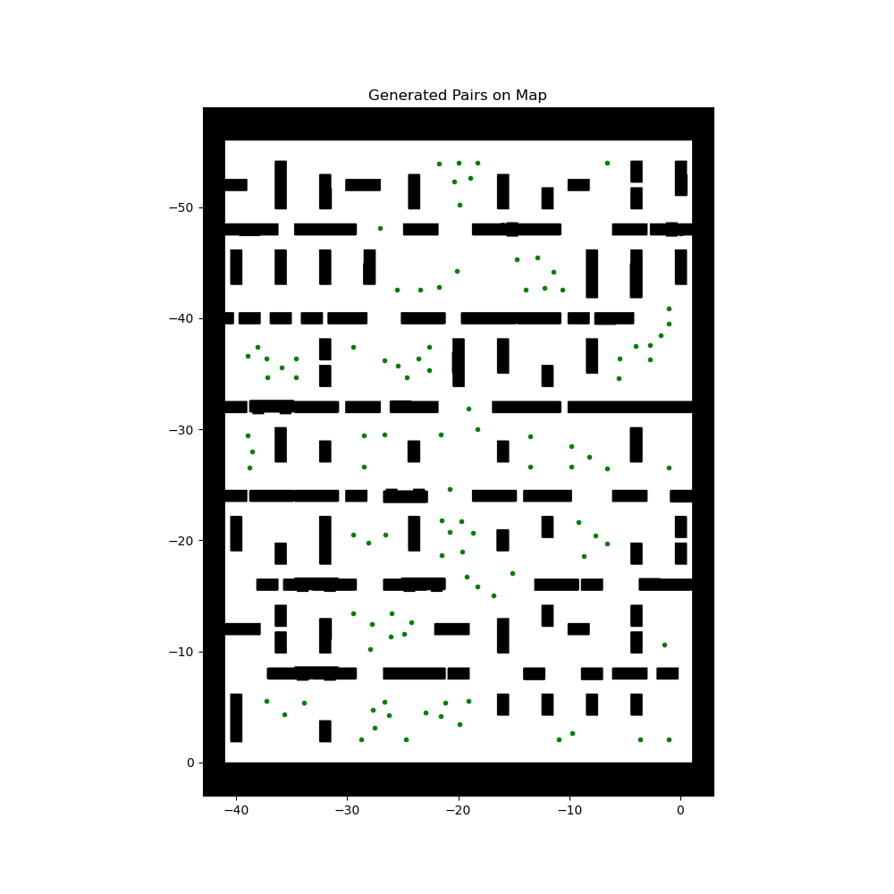

<video src="data_collection_screencast.webm" controls="controls" style="max-width: 100%; height: auto;"></video>

## MPPINet Architecture & Design Rationale

To accurately predict the necessary control trajectory, our MPPINet model employs a hybrid, two-stream neural architecture designed to separate spatial understanding from kinematic state representation before performing late fusion. 

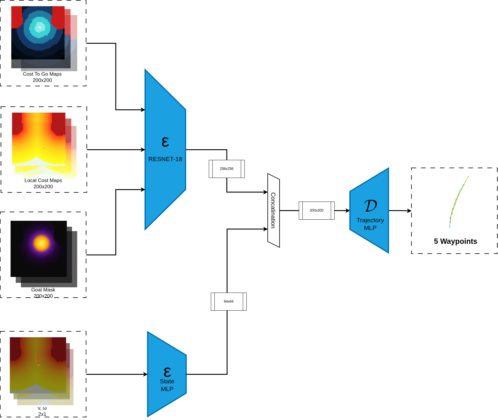

### What the Model is Doing
1. **Spatial Feature Extraction:** The model ingests a 3-channel image tensor (3 x H x W) composed of the Local Costmap, the Cost-to-Go Map, and the Goal Mask. This stacked spatial representation is passed through a **ResNet-18** backbone, which acts as a powerful spatial feature extractor. The output is flattened into a 256-dimensional spatial embedding.
2. **Kinematic State Encoding:** Concurrently, the robot's current velocities ($v_x$, $v_y$, $\omega$) are fed into a separate **State MLP** (Multi-Layer Perceptron), yielding a 64-dimensional kinematic state embedding.
3. **Late Fusion:** The spatial embedding (256-d) and the state embedding (64-d) are concatenated to create a dense 320-dimensional vector in a process known as late fusion.
4. **Trajectory Prediction:** This fused context vector is then passed through a final **Trajectory MLP**, which regresses the predicted local trajectory (a sequence of $K$ waypoints, e.g., 5 waypoints).

### Why We Chose This Architecture
- **ResNet-18 for Robust Spatial Understanding:** Navigation relies heavily on understanding complex, unstructured environments (e.g., tight corners, cluttered obstacles). ResNet's residual connections allow it to learn deep, robust, hierarchical representations of the costmap efficiently without suffering from vanishing gradients.
- **Separation of Concerns (Two-Stream Approach):** By processing the spatial maps and the kinematic state independently, the network prevents the low-dimensional velocity data from being "washed out" or overpowered by the high-dimensional image data during early feature extraction. 
- **Late Fusion for Momentum Conditioning:** Fusing the embeddings at the very end allows the model to first understand *where* it is and *where* it needs to go (spatial), and then condition that spatial plan on its current momentum (state). This ensures the predicted trajectory respects the physical constraints of the robot (e.g., preventing it from predicting physically impossible immediate sharp turns when the robot is moving at high speeds).

## 1. High-Level Insights
- **Adherence to Target (Cross-Track Error):** We measured how much the robot veered off the global plan by calculating the average minimum distance (AMD) between the actual traversed path (odom) and the target global plan.
- **Speed Robustness:** We explicitly isolated the high-speed traversal (0.6 - 0.9 m/s) to verify stability.
- **Rollout Variance:** The standard deviation (SD) of point-by-point discrepancies between the MPPINet and Classical predictions was calculated across *all* of these runs simultaneously to see how variance scales along the rollout horizon.

## 2. Overall Trajectory Deviation SD (Across All Analyzed Runs)
The following graph visualizes the Standard Deviation of the absolute distance between MPPINet's predicted waypoint and the Classical MPPI's predicted waypoint, indexed from the start of the horizon (Waypoint 1) to the end (Waypoint 20). 

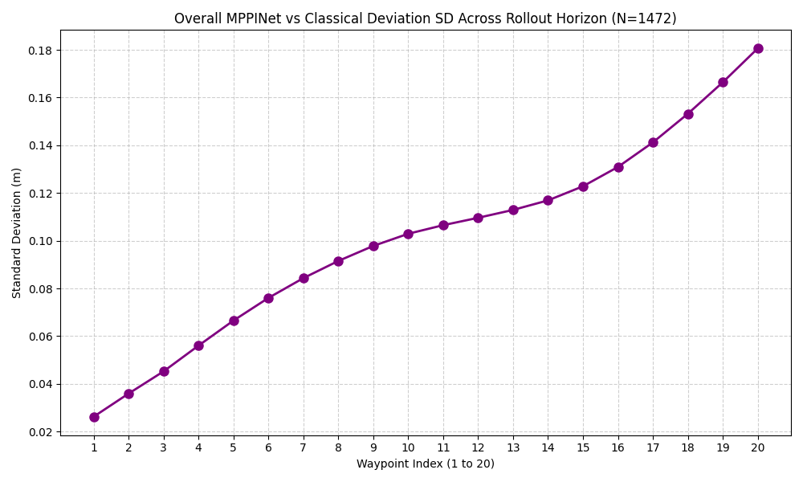

**Insight:** As the waypoint index increases (looking further into the future of the rollout horizon), the standard deviation naturally scales up. The model is extremely confident and accurate up to Waypoint 12 (~0.1m SD), after which the uncertainty compounds slightly but remains remarkably bounded below 0.2m at the very end of the horizon.

## 3. Deviation Profile of Individual Runs
Here are a few deeper dive statistical plots from specific runs showing how the first waypoint tracks over time, and how the mean/median deviation diverges along the horizon:

### Normal Run - `rosbag2_2026_09_18-16_11_41` (Run 2)
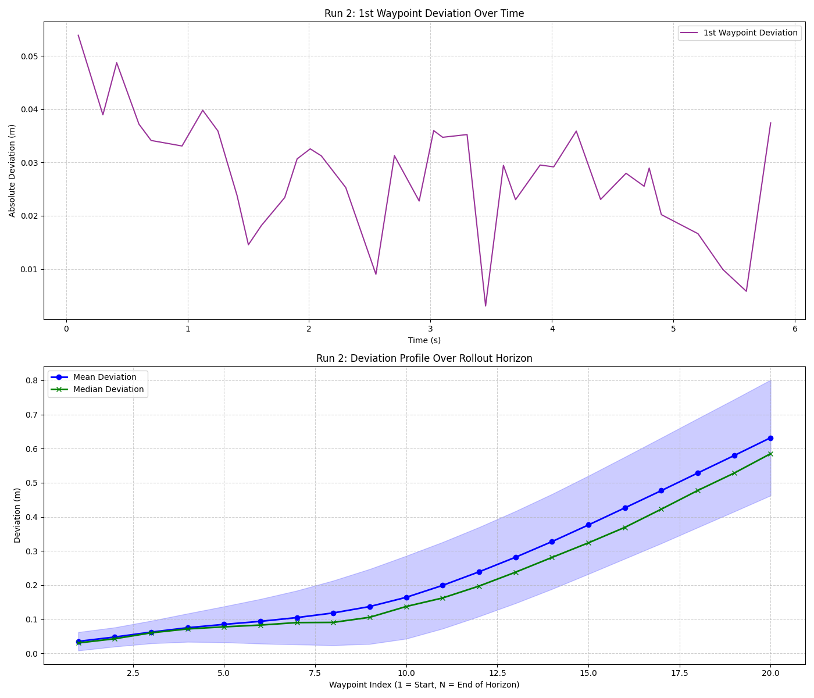

### High Speed Run - `rosbag2_2026_09_17-16_05_46` (Run 2)
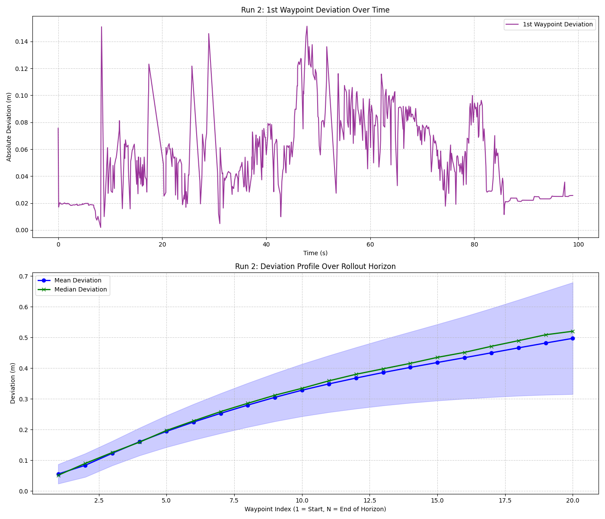

### Normal Run - `rosbag2_2026_09_17-16_36_50` (Run 1)
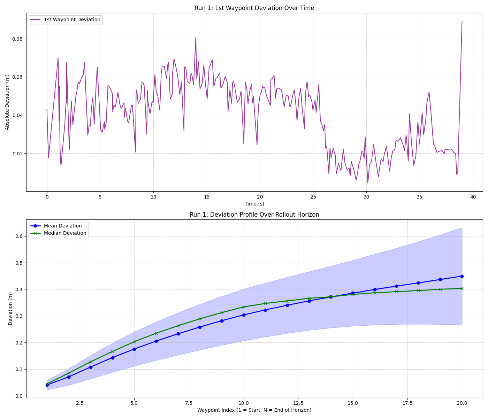

## 4. Spatial Trajectory Comparisons

### rosbag2_2026_09_17-16_42_25 (Run 1) - Normal Run 1
- **Average Veering off Global Path (Odom -> Plan):** `0.0658 meters`

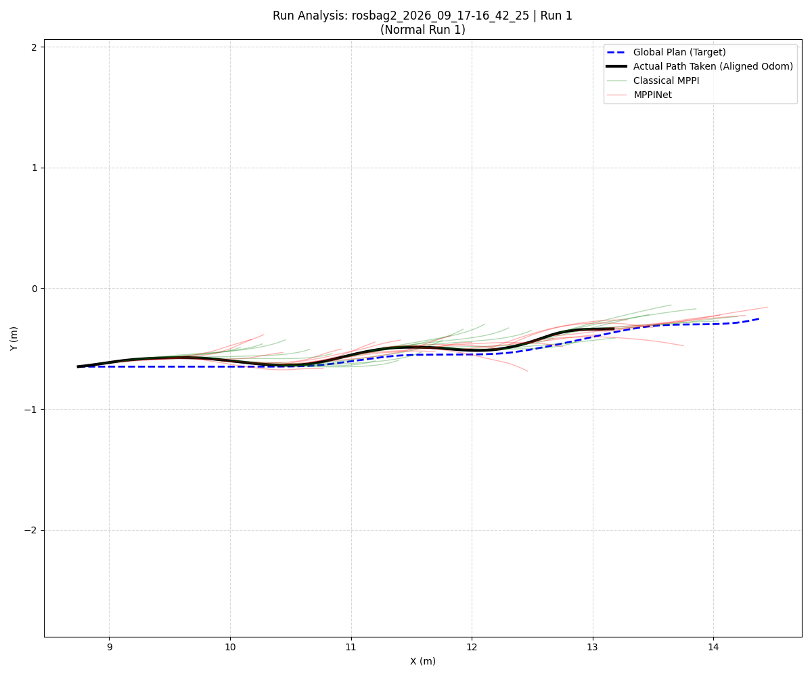

### rosbag2_2026_09_18-16_11_41 (Run 2) - Normal Run 2
- **Average Veering off Global Path (Odom -> Plan):** `0.0543 meters`

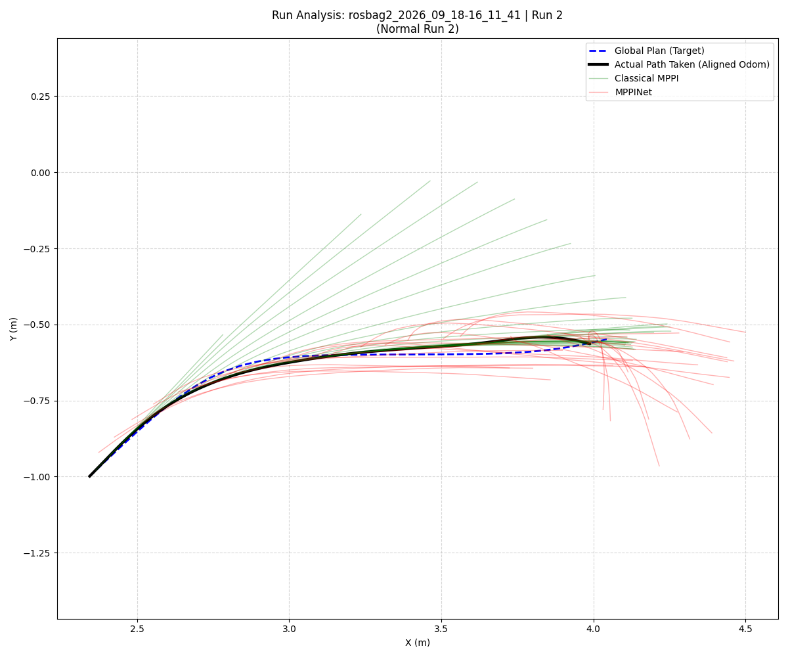

### rosbag2_2026_09_17-16_36_50 (Run 1) - Normal Run 1
- **Average Veering off Global Path (Odom -> Plan):** `0.0487 meters`

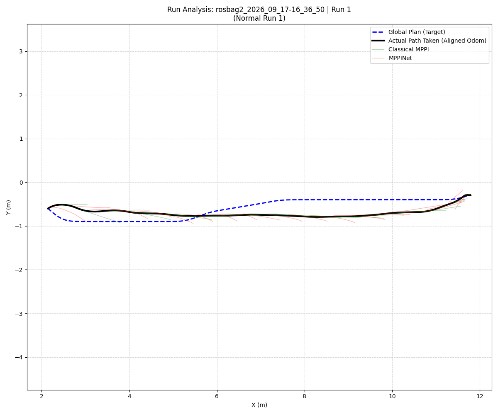

### rosbag2_2026_09_17-16_36_50 (Run 2) - Normal Run 2
- **Average Veering off Global Path (Odom -> Plan):** `0.0763 meters`

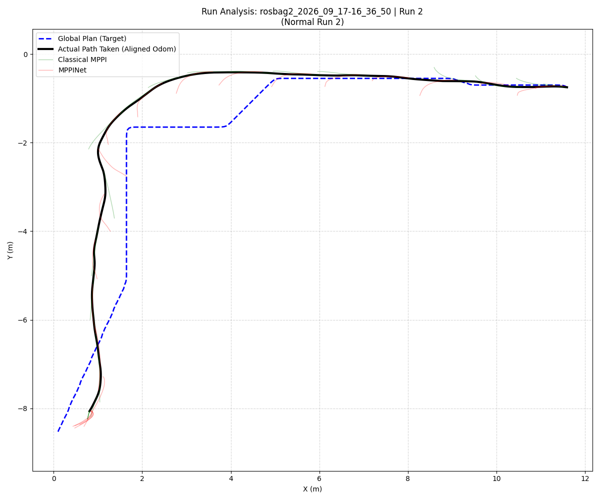

### rosbag2_2026_09_17-16_05_46 (Run 2) - High Speed Run (0.6-0.9m/s)
- **Average Veering off Global Path (Odom -> Plan):** `0.0912 meters`

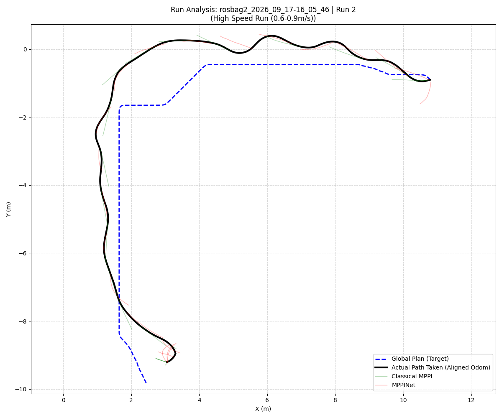

## 5. Hardware Performance Insights (NVIDIA Jetson)

To ensure our inference node could run sustainably on edge hardware without starving the underlying ROS 2 navigation stack, we recorded resource utilization during active inference. 

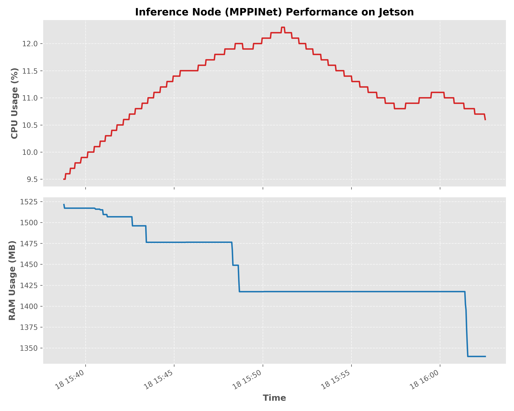

**Key Observations:**
- **CPU Utilization:** The MPPINet inference node consumes an average of **11.19% CPU**, peaking at only **12.30%**. This is highly efficient and leaves ample compute headroom for DLIO, ICP, and the Nav2 global planner to execute concurrently.
- **Memory Footprint:** System RAM usage remained remarkably stable, averaging **1.44 GB** with a peak of **1.52 GB**. On the Jetson's unified memory architecture, this footprint encompasses both the application overhead and the PyTorch model weights/activations. This compact memory profile proves that the `src4` model is exceptionally well-suited for edge deployment on SWaP-constrained robotic platforms.
